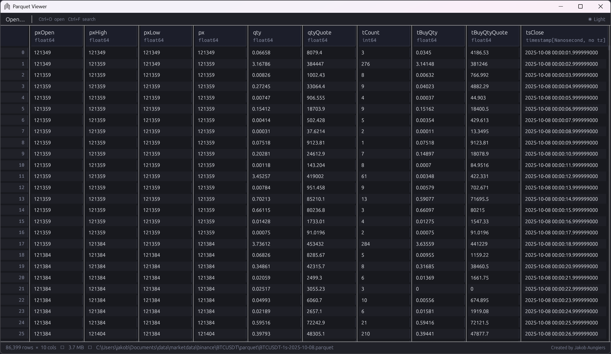
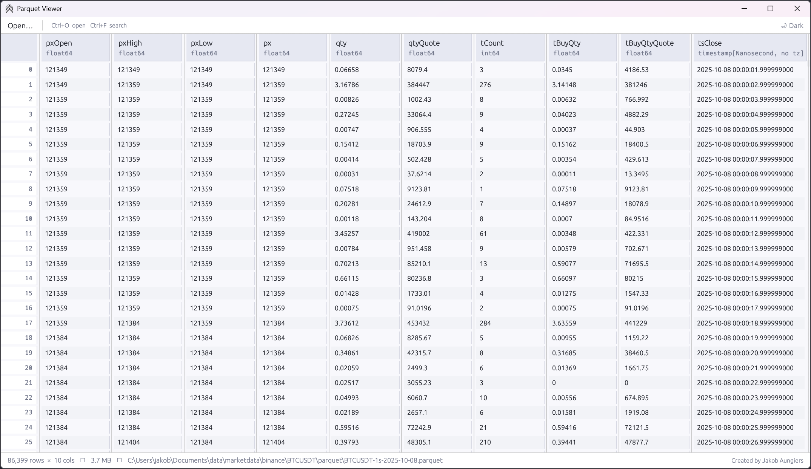

# Fast Parquet Viewer (fork)

A fast, lightweight desktop viewer for `.parquet` files, built with Rust and [egui](https://github.com/emilk/egui).
Has a modern interface that opens extremely fast and can be bound to .parquet files to make it the default app for opening parquet files.

This is a fork of [jaungiers/Fast-Parquet-Viewer](https://github.com/jaungiers/Fast-Parquet-Viewer)
by Jakob Aungiers, adding a **column name search** feature (see below). All credit for
the original application goes to the upstream author; this fork is distributed under the
same MIT license.





## Features

- **Drag & drop** a `.parquet` or `.parq` file onto the window to open it
- **File dialog** via the `Open…` button or `Ctrl+O`
- **Virtual scrolling** — handles large files without loading the full table into view at once
- **Column sorting** — click any column header to sort ascending/descending (numeric-aware)
- **Search / filter rows** — `Ctrl+F` to filter rows by any matching cell value, with match highlighting
- **Search columns** — `Ctrl+Shift+F` (or the column-search button) to find a column by
  name (case-insensitive substring match); the table scrolls to and highlights matching
  column headers, cycling through matches with Enter / Shift+Enter or the prev/next buttons
- **Schema display** — column names and data types shown in the header
- **Status bar** — shows row/column count and file size
- **CLI support** — pass a file path as an argument: `ParquetViewer.exe data.parquet`
- Dark theme

## Building from source

Requires [Rust](https://rustup.rs/) (stable).

```sh
git clone https://github.com/SimonPoparda/fast-parquet-viewer
cd fast-parquet-viewer
cargo build --release
```

## Dependencies

| Crate | Purpose |
|---|---|
| [eframe](https://github.com/emilk/egui/tree/master/crates/eframe) / [egui](https://github.com/emilk/egui) | GUI framework |
| [egui_extras](https://github.com/emilk/egui/tree/master/crates/egui_extras) | Virtual-scroll table widget |
| [arrow](https://github.com/apache/arrow-rs) | Column data model |
| [parquet](https://github.com/apache/arrow-rs/tree/master/parquet) | Parquet file reading |
| [rfd](https://github.com/PolyMeilex/rfd) | Native file dialog |

## Original author

Jakob Aungiers — [jaungiers/Fast-Parquet-Viewer](https://github.com/jaungiers/Fast-Parquet-Viewer)
